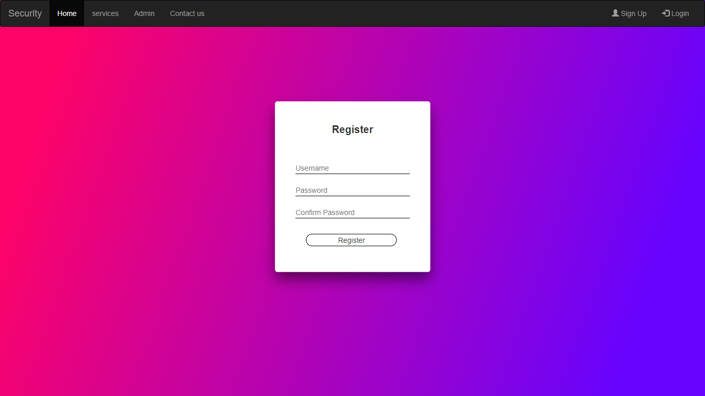
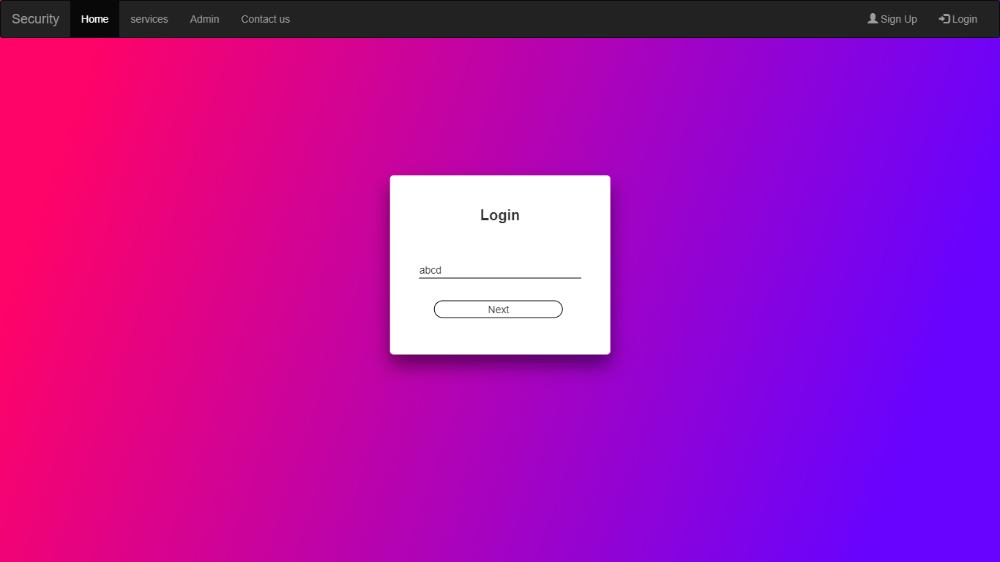
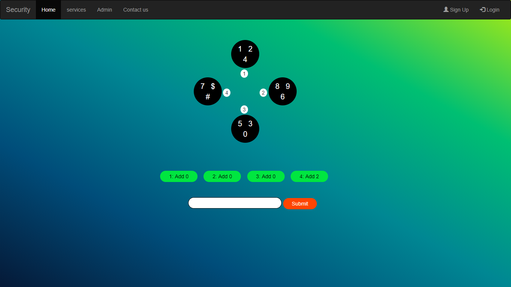

# SecurityPass
This project is to make sure the password is not revealed during
the entry if the password by the user. Whenever the user tries to enter
the password for some login purpose, it is more prone to being noticed
by others who may use it for wrong deeds.

In this the password is entered in a way different from the
traditional login pages. Here the wrong entry of the password for 5
times continuously will cause the account to be blocked for 24 hours.
Also, the options provided during the entry of the password change
randomly when the user refreshes the page or enters a wrong
password.

This saves the account from brute force attack which is used
generally to penetrate into the accounts of users by simply guessing
the password which is usually set up by the user during registration.
Most of the users usually set passwords which are of strong so that
they can be easily remembered, but this causes the brute force attack
to be successful. But using this method, we can save accounts for brute
force attack as they entry of passwords is restricted only to 5 times.
This method uses random generation of numbers for buttons to
enter the password. Hence this is a suitable method for securing
passwords.

## Features
1. The IP address gets noted whenever we login.
2. Options given for the entry of password, changes every time we
refresh the page. New options appear randomly whenever we
refresh the page or enter a wrong password. Hence the password
we enter also changes every time.
3. The account gets blocked for 24 hours if we enter a wrong
password continuously for 5 times.
4. This prevents the threat of brute force attack as the account
would get blocked if a wrong password is entered for 5 times in a
row.
5. If the user enters the dashboard without logging in, the user
would be asked to login first to continue.

## Getting Started

Below link is the implemented version of the entire project.
http://securitypass.epizy.com/

### Prerequisites

Your system must be installed with xampp/wampp server running with Apache and MySQL servers.

### Installing

If you want to deploy this project in you machine, import the securitypass.sql file into mysql. Change the database name in database.php.
Otherwise, you can test the implemented model( http://securitypass.epizy.com/ ).

## Running the tests

### 1. Registration page

### 2. Login page

### 3. Password page

* For example, the password is set as 123 by the user while
registration.
* First, the block number containing the first digit is checked. 
* If it is present in block 1, then the number to be added to the first digit is checked in the given square boxes below. 
Suppose 1 is to be added to the block according to the given box below, the total would be 2.
Hence block 2 should be clicked for the first digit to be entered.
* This process is continued for the remaining digits entry.
* If the sum of the number exceeds the number of blocks present, the count should be started from block 1 again.
For example, if the sum is 6, and the blocks present are only 4, block 2 should be clicked.

## Built With

* HTML
* CSS
* BootStrap
* php
* MySQL

## Authors

* **S.Dinesh**
* **Ch.Shivani**
* **V.S.S.Gowri**
* **B.Manoj**
